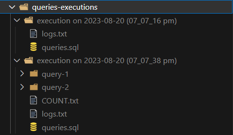
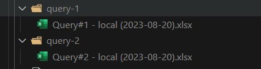
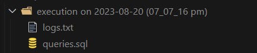

## Connect-to-DB

It is utility build using NodeJS, with following purpose:

- to run same query/queries on multiple DB instances
- to get export of data, fetched as a result of that `SELECT` query when ran on different DB instances

## Table of Content

* [Introduction](#introduction)
* [Steps to Run it](#steps-to-run-it)
* [Features](#features)
* [Technologies used](#technologies-used)
* [NOTE](#notes)

## Introduction

Connect-to-db is a pure backend utility that enables a user to connect to DB (*right now only MySQL*) using the code base i.e., NodeJS and run different DML, DDL etc queries on the desired DB instance(s) which are set in `db_config.js` file.

## Steps to Run it

- Install **NODE JS** from [here](https://nodejs.org/en/download), if not installed (node version should be greater than 14)
- Clone or download the repo
- open terminal in the folder where this repo is cloned or downloaded and run
  ```
  npm install
  ```
- Set the DB configurations in **`db_configs.js`** file. A sample is given in **`db_config.js`** file or check the following:
  ```javascript
  {
      name: "local",
      host: "localhost",
      user: "root",
      password: "*****",
      database: "my-db"
   },
  ```
- Paste your **Queries** in `queries.sql` file (*each query must end with semicolon*).
- Run
  ```
  node app.js
  ```

## Features

1. Add multiple queries in `queries.js` file and run it on all the DBs, whose configuration has been added in **`db_configs.js`** file, in one go.
2. Get the complete queries execution history in **queries-execution** folder, whenever user will run the querie(s). This folder will contain many **sub-folders** (named as the *execution date and time* of queries)**,** where each folder will contain all the data related to a single execution of all the queries (like COUNT, exports of each `SELECT` query, logs and queries ran) added in `queries.js` file.
   
3. Get the **export** of each `SELECT` query, by setting the **`should_export:true`** in `app.js` file, like this
4. Get the **COUNT** of results of each `SELECT` query on each DB config in `COUNT.txt` file in the sub-folder of **queries-execution** folder, in the following format

   ```javascript
   {
       "query_1": {
          "Prod_DB_1": 9,
   	"Prod_DB_2": 11
       },
       "query_2": {
          "Prod_DB_1": 5,
          "Prod_DB_2": 6
       }
   }
   ```
5. If `should_export:false` then user will get only **logs.txt** file, like this
   

## Technologies Used

* [mysql2](npmjs.com/package/mysql2) : to connect with MySQL DBs and run the queries
* [Moment.js](https://momentjs.com/) : to get the current date and time
* [xlsx](https://www.npmjs.com/package/xlsx) : to generate the exports of results
* [Node.js](https://nodejs.org/en): JavaScript runtime for server-side development.

## NOTE

This functionality is currently designed to execute queries exclusively for **MySQL database instances**. I have plans to extend this enhancement to cover our other databases in the future.
